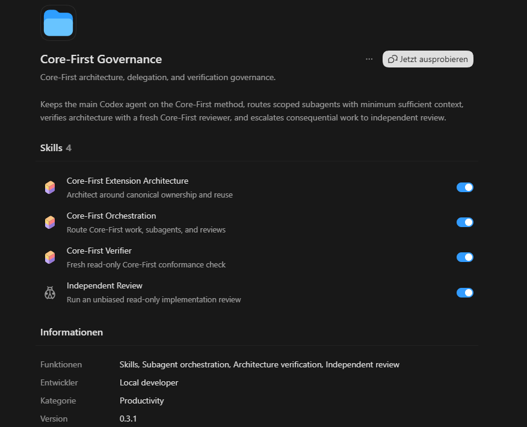

# Core-First Governance

Provider-neutral agent governance for Core-First software architecture, currently distributed as a **Codex plugin**. The governance model itself is intentionally independent of Codex-specific agent terminology or APIs.



## Why this exists

Long-running agent sessions can lose or compact context. A software-engineering method that only lives in remembered conversation state is fragile. Core-First Governance treats remembered Skill content as cache, not authority: architecture-relevant work reloads the canonical Core-First Skill when required, and important changes can be checked in a fresh read-only verification context.

It also avoids the opposite failure mode: giving every delegated agent the entire project history and every Skill. Each delegated lane receives the **minimum sufficient context, knowledge, and authority** required for its role.

## Provider-neutral terminology

| Canonical term | Meaning | Possible host terms |
| --- | --- | --- |
| **Primary agent** | User-facing root agent; orchestrator and final integrator | main agent, root agent, parent agent |
| **Delegated agent** | Any bounded child/specialist execution context | subagent, child agent, worker, session, tool-agent |
| **Targeted worker** | Bounded implementation/investigation lane with architecture already decided | worker/subagent |
| **Core-First advisor** | Delegated lane allowed to investigate architecture using Core-First | specialist/subagent |
| **Core-First verifier** | Fresh read-only Core-First conformance check | reviewer/subagent/fresh session |
| **Independent reviewer** | Anti-anchored review for consequential/high-risk work | reviewer, external model, separate context |

The skills define semantics, not a provider API. A host adapter maps those roles onto whatever delegation, Skill injection, context isolation, or model-selection mechanisms are actually available.

## Included skills

| Skill | Responsibility |
| --- | --- |
| `core-first-orchestration` | Primary-agent decision procedure for Core-First use, delegation, context isolation, freshness and review escalation. |
| `core-first-extension-architecture` | Canonical architecture method for ownership, reuse, composition, providers, extensions and core-rule changes. |
| `core-first-verifier` | Fresh, read-only Core-First conformance verification against requirements, authorities, raw diffs/files and actual evidence. |
| `independent-review` | Unbiased read-only review for consequential, high-risk, difficult-to-verify or materially blocked implementation work. |

## Operating model

```text
User
  ↓
Primary agent = orchestrator + final integrator
  ↓
core-first-orchestration
  ├─ Primary agent applies Core-First itself when architecture is material
  ├─ Targeted worker
  │    └─ bounded task; no Core-First Skill by default
  ├─ Core-First advisor/worker
  │    └─ architecture lane; loads Core-First fresh
  ├─ Investigator
  │    └─ bounded evidence gathering
  ├─ Fresh Core-First verifier
  │    └─ read-only; re-derives expected architecture
  └─ Fresh independent reviewer
       └─ high-risk/consequential work; anti-anchored input
```

### Primary invariant

Delegating to a Core-First-aware agent **never discharges the primary agent's own Core-First responsibility**. The primary agent still owns requirement understanding, delegation boundaries, integration, reconciliation, and the final response.

### Context and knowledge isolation

Every delegated lane explicitly selects:

- **Role** — worker, advisor, investigator, verifier, independent reviewer.
- **Skill knowledge** — none, Core-First, Independent Review, or another required Skill.
- **Project context** — minimum sufficient requirements, files, contracts, authorities, and evidence.
- **Excluded context** — especially prior narratives/conclusions when independence matters.
- **Authority** — explicit write and decision boundaries.
- **Lifecycle** — persistent specialist where useful; fresh context where independence is required.

A targeted worker that reaches an unresolved architecture boundary must return `ARCHITECTURE_DECISION_REQUIRED` instead of silently inventing a new owner, capability, extension seam, or foreign-state write path.

## Host portability

The portable skills do not require a specific `spawn_agent`, subagent, session, or MCP API. When a host supports explicit Skill injection, use it. Otherwise resolve/read the canonical Skill from an installed file or another verifiable source. If the host cannot provide fresh contexts or read-only enforcement, use the strongest available isolation and state the limitation instead of pretending the guarantee exists.

The current repository packages the portable skills for **Codex**. Other hosts should reuse the same Skill semantics and replace only packaging/adapter details.

## Windows / Codex UI installation

This repository includes `install-personal-windows.ps1`. The UI flow confirmed in this project installs the Codex plugin source under:

```text
%USERPROFILE%\.codex\plugins\core-first-governance
```

and maintains the personal marketplace file at:

```text
%USERPROFILE%\.agents\plugins\marketplace.json
```

Run from an extracted release directory:

```powershell
Set-ExecutionPolicy -Scope Process Bypass
.\install-personal-windows.ps1
```

Then:

1. Fully quit and restart the ChatGPT desktop app.
2. Open the Plugins Directory.
3. Select the personal marketplace/source.
4. Find **Core-First Governance** and install it.
5. Start a **new Codex thread** so the installed Skills are picked up cleanly.

The Codex UI installation was confirmed on Windows with all four bundled Skills visible and enabled.

## PowerShell signature

`install-personal-windows.ps1` is not Authenticode-signed in this repository. A valid publisher signature requires the publisher's code-signing certificate and private key.

With a suitable certificate in `Cert:\CurrentUser\My`:

```powershell
.\sign-installer.ps1 -Thumbprint <CERTIFICATE_THUMBPRINT>
```

Verify with:

```powershell
Get-AuthenticodeSignature .\install-personal-windows.ps1 | Format-List
```

## Repository layout

```text
.
├── README.md
├── CONTEXT_HANDOFF_2026-08-22.md
├── INSTALL-WINDOWS.md
├── install-personal-windows.ps1
├── sign-installer.ps1
├── docs/
│   └── codex-ui.png
└── core-first-governance/
    ├── .codex-plugin/
    │   └── plugin.json
    ├── SOURCE_PROVENANCE.md
    └── skills/
        ├── core-first-orchestration/
        ├── core-first-extension-architecture/
        ├── core-first-verifier/
        └── independent-review/
```

## Validation

Validate the current Codex package with the supplied Codex `plugin-creator` validator:

```bash
python validate_plugin.py core-first-governance
```

The rule ownership remains separated:

- orchestration owns agent-routing/context/freshness governance;
- `core-first-extension-architecture` remains the canonical architecture method;
- `core-first-verifier` applies that canonical method independently;
- `independent-review` remains the separate anti-anchored risk review;
- project/repository authorities remain project truth.

## Development rules

1. Preserve **one canonical owner per rule**; do not duplicate Core-First or Independent Review rules in orchestration.
2. Keep portable governance semantics provider-neutral. Put Codex/Claude/Gemini/etc. mechanics in host packaging or adapter documentation only.
3. Keep the primary agent as orchestrator/final integrator; do not introduce a parallel orchestrator agent.
4. Keep final Core-First verification fresh and read-only to the extent the host can enforce it.
5. Do not preload Core-First into the independent reviewer merely because the implementation used it.
6. Re-run provider/package validation after manifest or Skill changes.
7. Test fresh-context pickup after installation/update.

## Provenance

`core-first-extension-architecture` remains unchanged from the supplied standalone canonical Skill. `independent-review` was adapted in v0.4.0 only to remove Codex/multi-MCP-specific reviewer transport wording while preserving its review policy. See `core-first-governance/SOURCE_PROVENANCE.md`.

## License

No repository license has been selected. Add the intended license before public redistribution if explicit terms are required.
